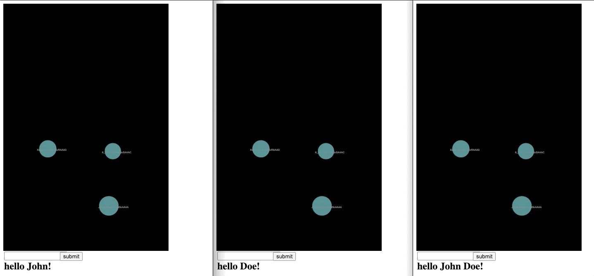
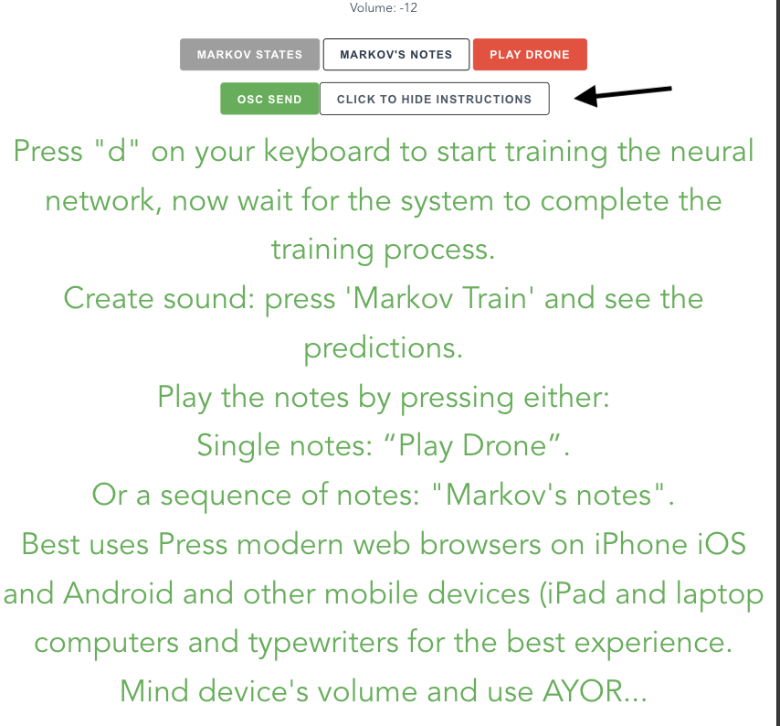

# Lick the toad
Hybrid sonification project using machine learning and neural networks.

Some primary videos demonstrating the project can be found [here](https://www.youtube.com/playlist?list=PLiCZTYIqSUAb1J-Iu4lhVwDz6ljKCVj-W)

## Overview of the project
This project aims to explore the idea of remoteness & isolation. It is a custom made system that works as a digital bridge over interconnected peers across the network (currently works only locally).  This project stems from my personal interest using custom made generative systems enacting human interaction and sonification. Modus Operandi: 

### User Interface
Each user is assigned a ball object, dragging it X and Y positions are logged as training data of the model of the neural network module.

The generated output can control real time sonfication algorithms which will run independently, but it may also be used as raw material for live coding and thusly expand on other performance possibilities and interactive media making it a highly flexible and versatile project. 

### Training Interface

At the moment the system uses a model to train a neural network using the X and Y of the user inputs, once the model is trained the system streams out the prediction rates using [regression](https://en.wikipedia.org/wiki/Regression_analysis) and X and Y values of the cursor position. These rates are then used as raw material for real time sound synthesis algorithms implemented in SuperCollider.

### Creative Outcomes
The system provides a hybrid mode of interaction, and can be used in many contexts. It can be installed as an interactive generative system and receice user data from remote users or local participants and can feed any audio system via OSC communication to create real time sonification algorithms.

## Technical specifications
The system is developed as a cross platform application running on NodeJS, and JavaScript and [SuperCollider](https://supercollider.github.io), and [ml5](https://ml5js.org) for the implementation of machine learning capabilities. I am using SC for sonification but any other audio environment able to receive OSC messages can be used.

## Setup
Download and unzip the project, enter the root folder and run "npm install" to install all necessary libraries required. Run "node server.js" to start the server. The application should show the ip address of the application running. Open a new browser page and go to "127.0.0.1:8000/main" to start the predictions and create sound. Press the instruction . In case OSC messages are not showing in the terminal modify the file "public/main/components/user-interface.js" ip address in line: `oscWebSocket: new osc.WebSocketPort({url: "ws://yourIPAddress:8081, metadata:true})` with yours.

## Acknowledgments
I would like to express my gratitude to Dan Shiffman and the creative coding communities of [P5.js](https://p5js.org) and [Ml5.js](https://ml5js.org) respectivelly.

